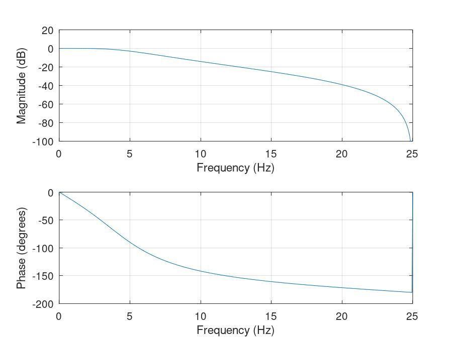
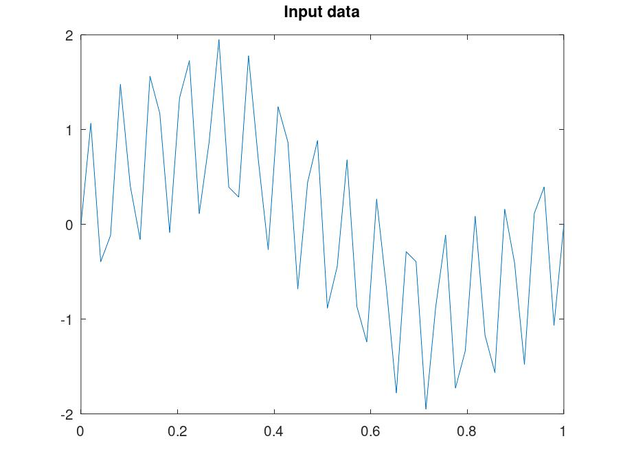
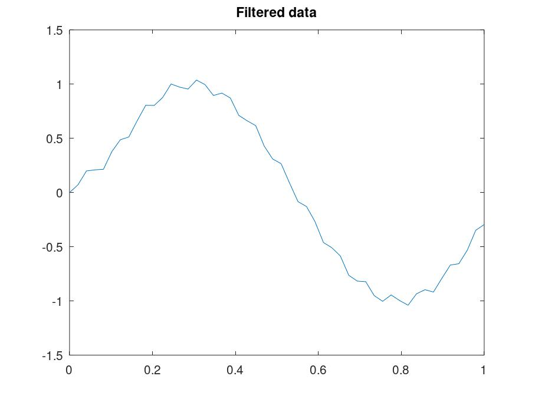
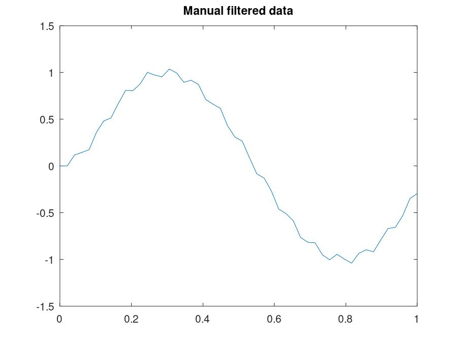
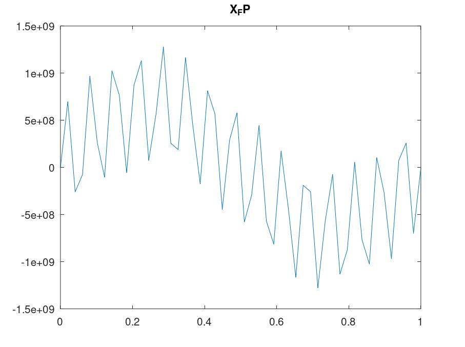
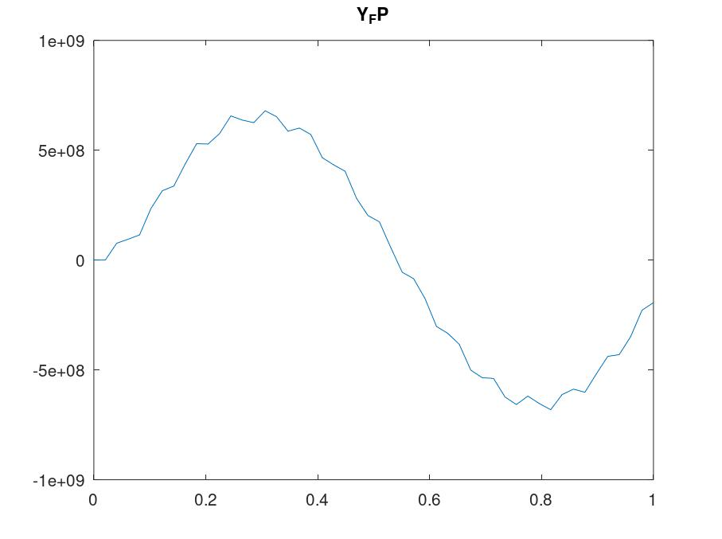
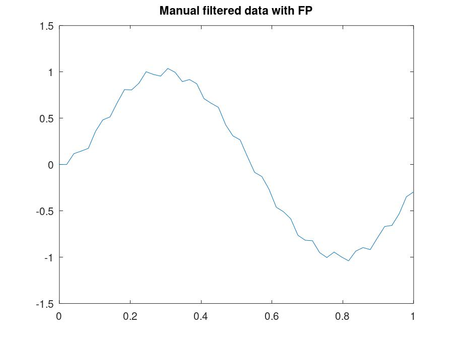

# Digital-Filter
Implementation of butterworth filter for a low pass filter

Low pass filter implementation with Butterworth filter order 2 with fixed point operation

## Getting Started
- Install octave from [here](https://octave.org/download)
- Install and load signal package (Ref: https://octave.sourceforge.io/signal/index.html)
  - Call the following commands in the Octave Command Window
    - `pkg install -forge signal`
    - `pkg load signal`
  - Further instruction reference to install and removing packages can be found [here](https://docs.octave.org/interpreter/) Section 37
- Run the lpf.m file in Octave

## Filter Demo

